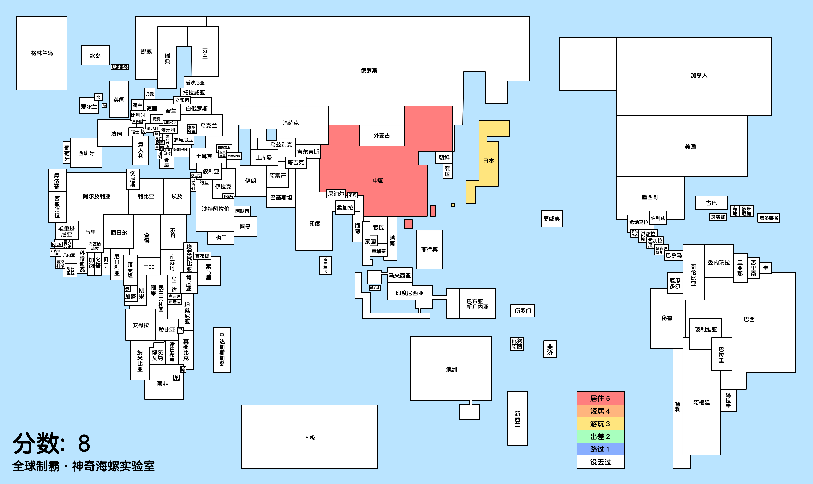

# 🌏「全球制霸生成器」全球部分国家地区制霸标记生成工具
https://lab.magiconch.com/world-ex/

目前为开发阶段，仅包含部分国家地区，形状面积位置名称均与现实不符

部分国家地区较远离岛可能允许分开标记
部分国家地区受限于展示形式未在页面中画出
受限于展示形式文字会据情况调整尺寸和缩减

虽然已经努力保留国家地区之间地缘相接特征，但因为信息量相比国而言多得多，不可避免存在参差，求反馈以及时修正

[缺少国家或地区反馈](https://github.com/itorr/world-ex/issues/3)

## 功能
可以在线标记 居住、短居、游玩、出差、路过 标记后可生成图片进行社区分享

标记过的信息会记录到本地存储，有什么新进展再次打开网页更新即可

## 说明
简化地图在保留了地缘相接特征的基础上把国家地区尽可能简化成了方框，目标是把国家地区之间的关系通过画面展现到一目了然的程度

有感兴趣画简化矢量地图的小伙伴欢迎来一起整活儿~ 

## 关于等级

先设定成了和中国制霸一致，大家有什么建议可以来评论说说ww
我的个人标准

 - 居住：住过年以上
 - 短居：住过月以上
 - 游玩：旅行过
 - 出差：去过但完全没玩
 - 路过：汽车火车路过或飞机经停

## 提示
请使用自带浏览器进行保存

## GitHub
https://github.com/itorr/world-ex

## 反馈
https://github.com/itorr/world-ex/issues

## 使用了
腾祥嘉丽大圆

## 协议
允许非商用非盈利的利用
